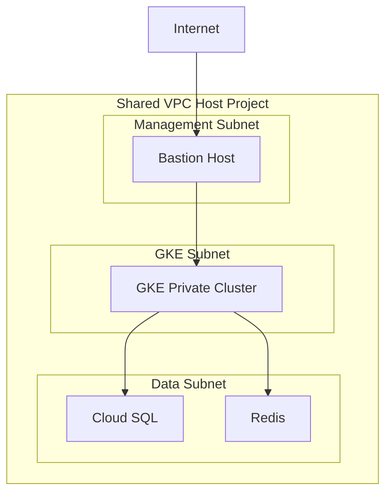
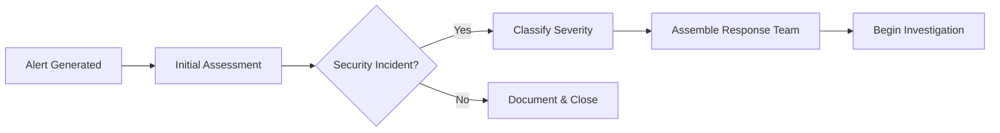
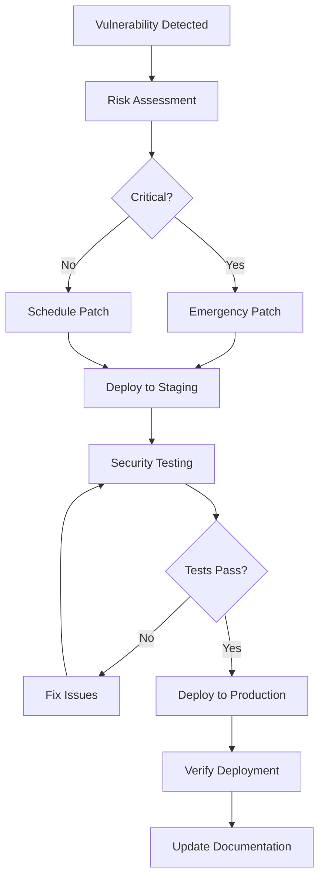

# Security Policy

This document outlines the security policies, procedures, and guidelines for the GCP Landing Zone project. Our commitment to security ensures that this infrastructure provides a robust foundation for fintech applications requiring the highest levels of protection.

## 🛡️ Security Overview

### Security Principles

Our security approach is built on these fundamental principles:

1. **Defense in Depth**: Multiple layers of security controls
2. **Zero Trust Architecture**: Never trust, always verify
3. **Principle of Least Privilege**: Minimum necessary access
4. **Encryption Everywhere**: Data protection at rest and in transit
5. **Continuous Monitoring**: Real-time security observability
6. **Compliance by Design**: Built-in regulatory compliance

### Threat Model

This landing zone is designed to protect against:

- **External Attacks**: Network intrusions, DDoS, malware
- **Insider Threats**: Privileged user abuse, data exfiltration
- **Data Breaches**: Unauthorized access to sensitive data
- **Service Disruption**: Availability attacks, resource exhaustion
- **Compliance Violations**: Regulatory non-compliance
- **Supply Chain Attacks**: Compromised dependencies or infrastructure

## 🚨 Reporting Security Vulnerabilities

### Responsible Disclosure

We take security vulnerabilities seriously and appreciate responsible disclosure. If you discover a security vulnerability, please follow these steps:

### How to Report

1. **DO NOT** create a public GitHub issue for security vulnerabilities
2. **DO** email security details to: `security@cloudon-one.com`
3. **DO** include as much detail as possible:
   - Description of the vulnerability
   - Steps to reproduce
   - Potential impact assessment
   - Suggested remediation (if known)
   - Your contact information

### What to Expect

- **Acknowledgment**: We'll acknowledge receipt within 24 hours
- **Initial Assessment**: Initial assessment within 72 hours
- **Regular Updates**: Progress updates every 7 days
- **Resolution Timeline**: We aim to resolve critical issues within 30 days
- **Credit**: We'll credit you in our security advisories (unless you prefer anonymity)

### Security Response Team

- **Security Lead**: security-lead@clouon-one.com

## 🔒 Security Architecture

### Network Security

#### VPC Design


#### Security Controls
- **Private Subnets**: All workloads in private subnets
- **NAT Gateway**: Controlled outbound internet access
- **VPC Service Controls**: Data perimeter protection
- **Private Google Access**: Secure access to Google APIs
- **Authorized Networks**: Restricted API server access

### Identity and Access Management

#### Service Accounts
```hcl
# Minimal privilege service account
resource "google_service_account" "gke_cluster" {
  account_id   = "gke-cluster-sa"
  display_name = "GKE Cluster Service Account"
  description  = "Service account for GKE cluster with minimal permissions"
}

# Grant only necessary roles
resource "google_project_iam_member" "gke_cluster_roles" {
  for_each = toset([
    "roles/logging.logWriter",
    "roles/monitoring.metricWriter",
    "roles/monitoring.dashboardEditor"
  ])
  
  project = var.project_id
  role    = each.value
  member  = "serviceAccount:${google_service_account.gke_cluster.email}"
}
```

#### Workload Identity
- **Pod-level Identity**: Each pod gets specific GCP permissions
- **No Service Account Keys**: Eliminate long-lived credentials
- **Automatic Rotation**: Identity tokens rotate automatically

### Data Protection

#### Encryption Standards
- **Data at Rest**: AES-256 encryption for all storage
- **Data in Transit**: TLS 1.3 for all communications
- **Key Management**: Google Cloud KMS for key management
- **Envelope Encryption**: Additional layer for sensitive data

#### Database Security
```hcl
resource "google_sql_database_instance" "analytics_db" {
  name             = "analytics-db"
  database_version = "POSTGRES_15"
  region          = var.region
  
  settings {
    # Security configurations
    backup_configuration {
      enabled                        = true
      point_in_time_recovery_enabled = true
      start_time                    = "03:00"
      backup_retention_settings {
        retained_backups = 7
        retention_unit   = "COUNT"
      }
    }
    
    ip_configuration {
      ipv4_enabled    = false
      private_network = google_compute_network.vpc.id
      require_ssl     = true
      
      authorized_networks {
        name  = "bastion-host"
        value = google_compute_instance.bastion.network_interface[0].network_ip
      }
    }
    
    database_flags {
      name  = "log_connections"
      value = "on"
    }
    
    database_flags {
      name  = "log_disconnections"
      value = "on"
    }
    
    database_flags {
      name  = "log_statement"
      value = "all"
    }
  }
  
  deletion_protection = true
}
```

### Container Security

#### GKE Security Features
- **Private Clusters**: Nodes have no public IP addresses
- **Shielded GKE Nodes**: Verifiable node integrity
- **Binary Authorization**: Only approved images deployed
- **Pod Security Standards**: Enforce security policies
- **Network Policies**: Micro-segmentation between pods

#### Container Image Security
```yaml
# Binary Authorization policy
apiVersion: v1
kind: ConfigMap
metadata:
  name: binary-authorization-policy
data:
  policy.yaml: |
    defaultAdmissionRule:
      requireAttestationsBy:
        - projects/PROJECT_ID/attestors/prod-attestor
      enforcementMode: ENFORCED_BLOCK_AND_AUDIT_LOG
    clusterAdmissionRules:
      us-central1-a.gke-cluster:
        requireAttestationsBy:
          - projects/PROJECT_ID/attestors/prod-attestor
        enforcementMode: ENFORCED_BLOCK_AND_AUDIT_LOG
```

### Monitoring and Logging

#### Security Monitoring
- **Audit Logs**: All administrative actions logged
- **VPC Flow Logs**: Network traffic monitoring
- **Cloud Security Command Center**: Centralized security insights
- **Real-time Alerting**: Immediate notification of security events

#### Log Analysis
```bash
# Example queries for security monitoring

# Failed authentication attempts
gcloud logging read 'protoPayload.methodName="google.iam.admin.v1.IAM.SetIamPolicy"
  AND protoPayload.authenticationInfo.principalEmail!=""
  AND protoPayload.status.code!=0'

# Unusual network traffic
gcloud logging read 'resource.type="gce_subnetwork"
  AND jsonPayload.connection.dest_port IN (22, 3389, 1433, 3306)
  AND jsonPayload.bytes_sent > 1000000'

# Service account key usage (should be rare)
gcloud logging read 'protoPayload.methodName="google.iam.admin.v1.IAM.CreateServiceAccountKey"
  OR protoPayload.methodName="google.iam.admin.v1.IAM.DeleteServiceAccountKey"'
```

## 🎯 Compliance

### Regulatory Frameworks

This landing zone is designed to support:

#### SOX (Sarbanes-Oxley)
- **Segregation of Duties**: Separate dev/prod environments
- **Audit Trails**: Comprehensive activity logging
- **Change Management**: Controlled infrastructure changes
- **Data Retention**: Long-term audit log retention

#### PCI DSS
- **Network Segmentation**: Isolated cardholder data environments
- **Access Controls**: Multi-factor authentication required
- **Encryption**: All cardholder data encrypted
- **Monitoring**: Continuous security monitoring

#### SOC 2 Type II
- **Security**: Comprehensive security controls
- **Availability**: High availability architecture
- **Processing Integrity**: Data integrity controls
- **Confidentiality**: Data classification and protection
- **Privacy**: Personal data protection

### Compliance Controls Matrix

| Control Domain | Implementation | Evidence |
|----------------|----------------|----------|
| Access Control | IAM policies, MFA | Audit logs, policy reviews |
| Data Protection | Encryption, DLP | Encryption reports, scan results |
| Network Security | VPC-SC, firewalls | Network topology, firewall rules |
| Monitoring | Cloud Logging, SIEM | Log retention, alert reports |
| Incident Response | Runbooks, escalation | Incident reports, response times |
| Change Management | GitOps, approvals | Pull request history, deployment logs |

## ⚡ Incident Response

### Security Incident Categories

#### Critical (P0)
- Active data breach or unauthorized access
- Compromise of production systems
- Complete service outage due to security incident
- **Response Time**: Immediate (within 15 minutes)

#### High (P1)
- Suspected data breach
- Compromise of non-production systems
- Significant security control failure
- **Response Time**: Within 1 hour

#### Medium (P2)
- Security policy violation
- Suspicious activity detected
- Minor security control failure
- **Response Time**: Within 4 hours

#### Low (P3)
- Security awareness issues
- Minor policy violations
- Informational security events
- **Response Time**: Within 24 hours

### Incident Response Process

#### 1. Detection and Analysis


#### 2. Containment and Eradication
- **Isolate**: Contain the threat to prevent spread
- **Preserve**: Maintain evidence for analysis
- **Eliminate**: Remove the threat from systems
- **Recover**: Restore services to normal operation

#### 3. Communication Plan
```
Critical Incident Communication Flow:
1. Security Team Lead (immediate)
2. CISO (within 15 minutes)
3. Legal/Compliance (within 30 minutes)
4. Executive Team (within 1 hour)
5. Customers (as required by regulation)
```

## 🔍 Security Testing

### Automated Security Testing

#### Static Analysis

```bash
# Terraform security scanning
tfsec . --format json --out tfsec-results.json

# Dockerfile security scanning
hadolint Dockerfile

# Kubernetes manifest scanning
kubesec scan deployment.yaml
```

#### Dynamic Analysis

```bash
# Container vulnerability scanning
trivy image gcr.io/PROJECT/app:latest

# Network security testing
nmap -sS -O target-ip-range

# Application security testing
zap-baseline.py -t https://app.example.com
```

### Manual Security Testing

#### Penetration Testing
- **Frequency**: Quarterly for production systems
- **Scope**: Full infrastructure and applications
- **Standards**: OWASP Testing Guide, NIST SP 800-115
- **Reporting**: Executive summary with remediation timeline

#### Red Team Exercises
- **Frequency**: Annually
- **Objective**: Test detection and response capabilities
- **Scenarios**: Advanced persistent threats, insider threats
- **Outcomes**: Improvement of security controls and procedures

### Security Testing Checklist

#### Infrastructure Testing
- [ ] Network segmentation validation
- [ ] Firewall rule effectiveness
- [ ] VPC Service Controls verification
- [ ] IAM policy testing
- [ ] Encryption verification
- [ ] Backup and recovery testing

#### Application Testing
- [ ] Authentication and authorization
- [ ] Input validation and sanitization
- [ ] Session management
- [ ] Error handling
- [ ] Logging and monitoring
- [ ] Data protection

## 📋 Security Hardening

### GKE Hardening Checklist

#### Cluster Configuration
- [ ] Private cluster enabled
- [ ] Authorized networks configured
- [ ] Master auth networks restricted
- [ ] Legacy ABAC disabled
- [ ] Network policy enabled
- [ ] Pod security policy enabled
- [ ] Binary authorization enabled
- [ ] Workload identity enabled
- [ ] Shielded GKE nodes enabled

#### Node Configuration
```yaml
# Secure node pool configuration
apiVersion: v1
kind: NodePool
spec:
  config:
    machineType: "n1-standard-4"
    diskType: "pd-ssd"
    diskSizeGb: 100
    
    # Security configurations
    shieldedInstanceConfig:
      enableSecureBoot: true
      enableIntegrityMonitoring: true
    
    workloadMetadataConfig:
      mode: GKE_METADATA
    
    # Disable legacy endpoints
    metadata:
      disable-legacy-endpoints: "true"
    
    # Enable audit logging
    serviceAccount: "gke-nodes@PROJECT.iam.gserviceaccount.com"
    oauthScopes:
      - "https://www.googleapis.com/auth/cloud-platform"
```

### Database Hardening

#### Cloud SQL Security Configuration
```sql
-- Enable audit logging
ALTER SYSTEM SET log_statement = 'all';
ALTER SYSTEM SET log_connections = 'on';
ALTER SYSTEM SET log_disconnections = 'on';
ALTER SYSTEM SET log_min_duration_statement = 1000;

-- Enforce SSL connections
ALTER SYSTEM SET ssl = 'on';
ALTER SYSTEM SET ssl_cert_file = 'server-cert.pem';
ALTER SYSTEM SET ssl_key_file = 'server-key.pem';
ALTER SYSTEM SET ssl_ca_file = 'ca-cert.pem';

-- Security-related parameters
ALTER SYSTEM SET shared_preload_libraries = 'pg_stat_statements,auto_explain';
ALTER SYSTEM SET auto_explain.log_min_duration = '3s';
```

### Network Security Hardening

#### Firewall Rules Review
```bash
# Review all firewall rules
gcloud compute firewall-rules list \
  --format="table(name,direction,priority,sourceRanges.list():label=SRC_RANGES,allowed[].map().firewall_rule().list():label=ALLOW,targetTags.list():label=TARGET_TAGS)"

# Identify overly permissive rules
gcloud compute firewall-rules list \
  --filter="sourceRanges:('0.0.0.0/0') AND allowed.ports:('0-65535' OR '22' OR '3389')" \
  --format="value(name)"
```

## 🏛️ Governance

### Security Governance Framework

#### Roles and Responsibilities

| Role | Responsibilities |
|------|------------------|
| CISO | Strategic security leadership, risk management |
| Security Architect | Security design, standards definition |
| Security Engineer | Implementation, monitoring, incident response |
| DevSecOps Engineer | Security automation, CI/CD pipeline security |
| Compliance Officer | Regulatory compliance, audit management |

#### Security Policies

1. **Information Security Policy**: Overall security framework
2. **Access Control Policy**: User access management
3. **Data Classification Policy**: Data handling requirements
4. **Incident Response Policy**: Security incident procedures
5. **Change Management Policy**: Secure change processes
6. **Third-Party Risk Policy**: Vendor security requirements

### Security Metrics and KPIs

#### Security Metrics Dashboard
```
Security Scorecard:
├── Vulnerability Management
│   ├── Critical vulnerabilities: 0
│   ├── High vulnerabilities: 2
│   ├── Mean time to patch: 3 days
│   └── Patch compliance: 98%
├── Access Management
│   ├── Privileged accounts: 12
│   ├── MFA coverage: 100%
│   ├── Access reviews completed: 95%
│   └── Service account keys: 0
├── Incident Response
│   ├── Mean time to detect: 15 minutes
│   ├── Mean time to respond: 45 minutes
│   ├── Mean time to recover: 2 hours
│   └── Security incidents: 3 (month)
└── Compliance
    ├── SOX compliance: 100%
    ├── PCI DSS compliance: 100%
    ├── SOC 2 compliance: 100%
    └── Audit findings: 0
```

## 📚 Security Training

### Required Training

#### All Personnel
- Security awareness training (annual)
- Phishing simulation exercises (quarterly)
- Incident response procedures
- Data classification and handling

#### Technical Staff
- Secure coding practices
- Infrastructure security
- Container security
- Cloud security best practices

#### Management
- Risk management
- Compliance requirements
- Incident response leadership
- Third-party risk assessment

### Training Resources

- [OWASP Top 10](https://owasp.org/www-project-top-ten/)
- [Google Cloud Security](https://cloud.google.com/security)
- [NIST Cybersecurity Framework](https://www.nist.gov/cyberframework)
- [CIS Controls](https://www.cisecurity.org/controls/)

## 🔄 Security Updates

### Patch Management

#### Critical Patches
- **Timeline**: Within 24 hours
- **Scope**: Security vulnerabilities with CVSS >= 9.0
- **Process**: Emergency change management
- **Validation**: Immediate security testing

#### High Priority Patches
- **Timeline**: Within 7 days
- **Scope**: Security vulnerabilities with CVSS >= 7.0
- **Process**: Standard change management
- **Validation**: Full regression testing

#### Regular Patches
- **Timeline**: Within 30 days
- **Scope**: All other security updates
- **Process**: Scheduled maintenance windows
- **Validation**: Comprehensive testing

### Security Update Process


## 📞 Contact Information

### Security Team
- **Email**: security@cloudon-one.com

### External Resources
- **Google Security Team**: https://cloud.google.com/support
- **Penetration Testing**: security-vendor@company.com
- **Legal Counsel**: law-firm@company.com

---

**Last Updated**: September 2025  
**Next Review**: December 2025  
**Document Owner**: Chief Information Security Officer  
**Classification**: Internal Use Only
